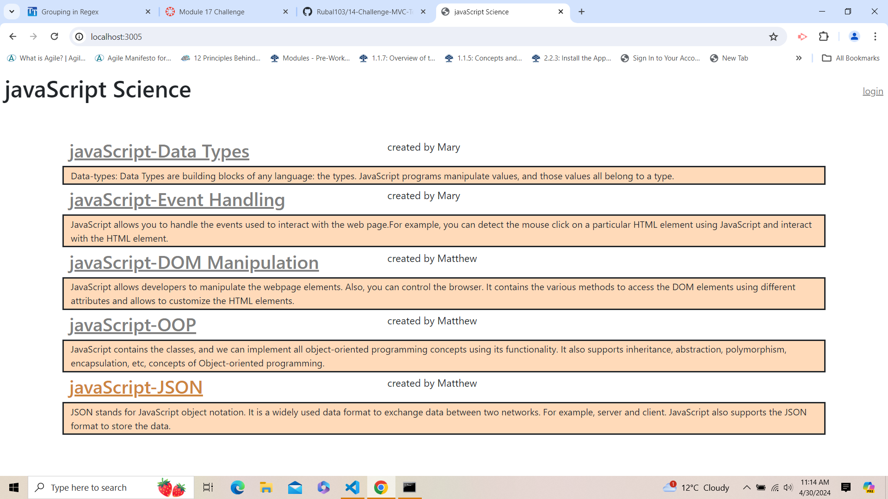
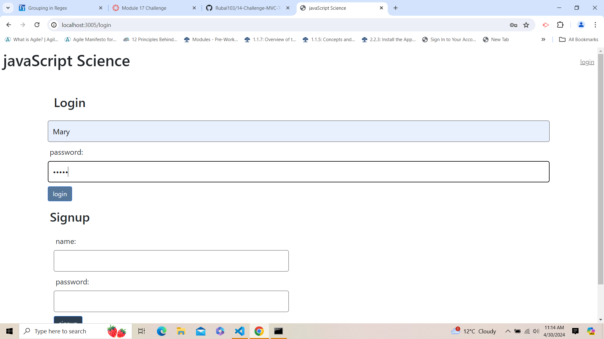
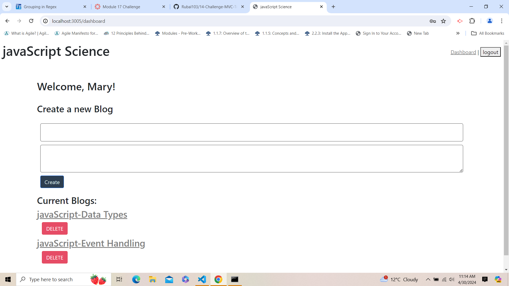
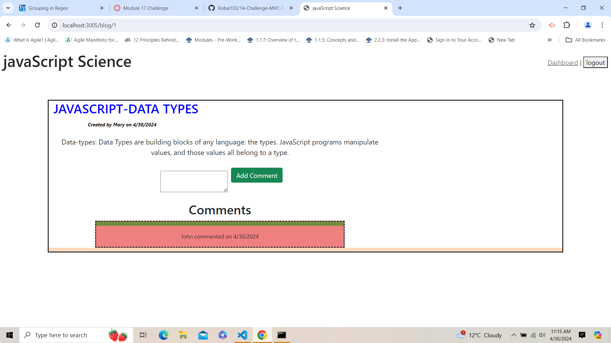
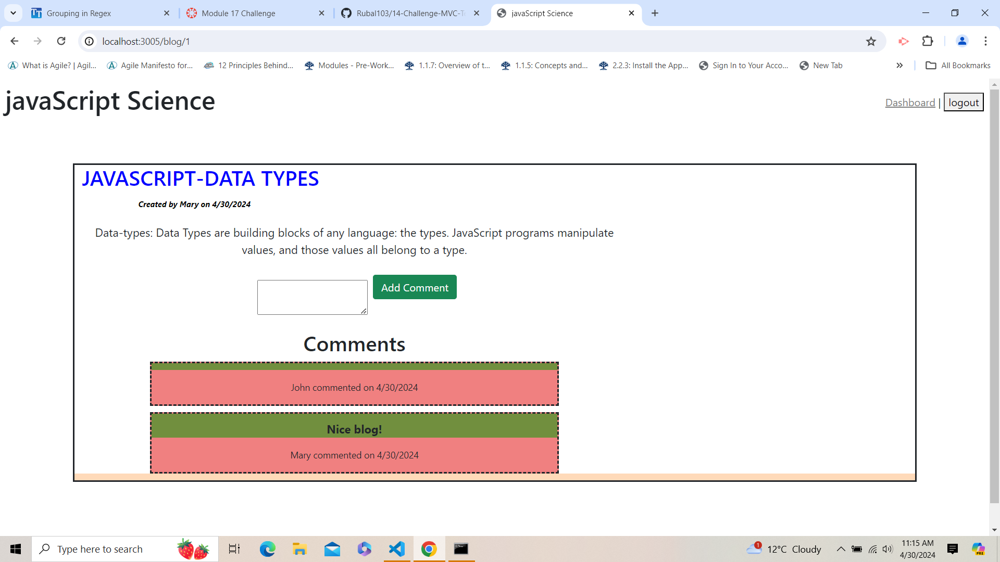

# 14-ChallengeMVC-Tech-Blog
Git repository to create Tech Blog for professionals, students, tech enthusiasts. 

## Features of the Applciation
* Using this Application user can create an account on the website, where they can write technology related blogs.  
* User can sign in and create their own blogs.
* User can see all the blogs created on the homepage by them and other users. 
* User can comment on their blogs and other user's blog after logging in. 
* User can delete their blogs after logging in. 

## Table of Contents

- [Technologies](#Technologies)
- [Resources](#Resources)

### Technologies
* javaScript
* CSS
* Bootstrap
* Nodejs

### Resources
* 28_Mini-Project
* Stack Overflow
* Youtube: https://www.youtube.com/watch?v=jNMJpv6Ty0s

## screenshots of the functioning Application
- 
- 
- 
- 
- 

## link to the video 
https://drive.google.com/file/d/1z5yhTrcBGeuMKDH18Q5_vJzxS7T9rXp8/view

## Author

I am a student and learning Full Stack Development. 

if you have any questions or any suggestions that I can improve upon please reach out to me at 
https://github.com/Rubal103

